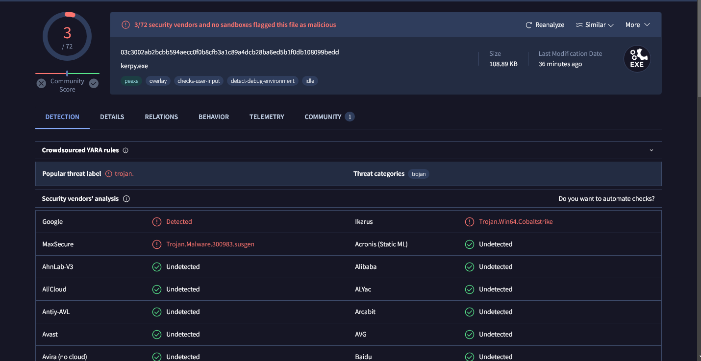

# VirusTotal Bypass ✅

- A tool designed to bypass VirusTotal detection.

## Detections
<p float="left" align="center">
  
</p>

## Features
- 🌠 +1500 VM List Blocked
- ⚡ Anti-VM (RDP, VirtualBox, etc)
- 🌟 Filters: MAC, HWID, IP, NAME, GPU, GUIDS, BIOS, DLL

## ⚠️ Important
 * This project is for educational purposes only! 
 * Do not use it for illegal activities!

## How to build
New version 
```cpp
g++ -o main main.cpp -lws2_32 -liphlpapi -luuid -lurlmon
```
------------
Old version
```cpp

g++ -o kerpy.exe kerpy.cpp -lws2_32 -liphlpapi

```

## Credits
- Telegram: @itachichrist
- The code was borrowed from [github.com/Lawxsz/bypass-virus-total](https://github.com/Lawxsz/bypass-virus-total)
